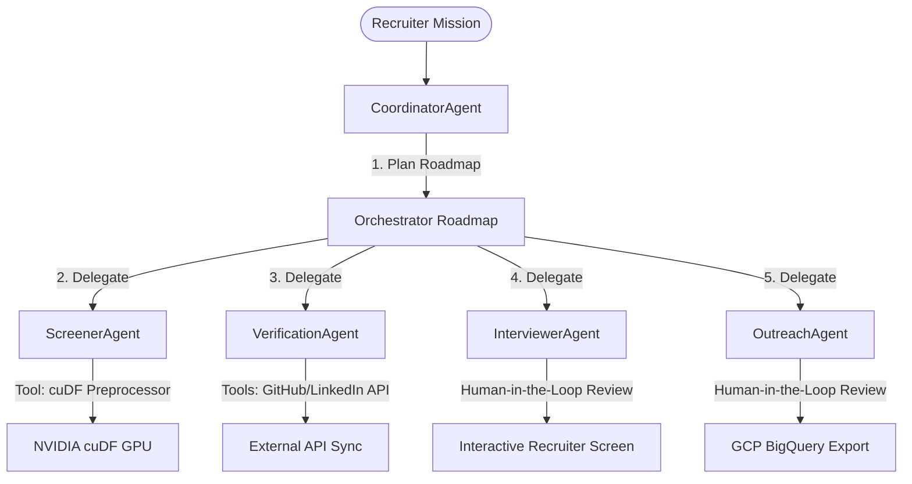

# ⚡ TalentSync AI - Hackathon Submission Guide

## 🏆 Project Goal
**TalentSync AI** is an autonomous multi-agent recruitment suite that operates as a team of **digital teammates** assisting corporate recruiters. The system ingests candidates, verifies their background credentials, maps their competencies, plans validation assessments, and drafts candidate outreach sequences—automating manual workflows and augmenting human decision-making with high-speed GPU acceleration.

---

## 🤖 1. The Multi-Agent Architecture (Digital Teammates)

TalentSync AI transitions the recruitment process from a static dashboard to a cooperative multi-agent execution pipeline. The system deploys a **primary coordinator** that guides specialized secondary agents:

### Specialized Agent Personas
1. **CoordinatorAgent (The Team Lead):**
   - **Role:** Planner and orchestrator.
   - **Action:** Takes the recruiter's overarching mission (e.g., *"Verify cloud scaling expertise and draft friendly outreach"*), compiles a sequence of logical subtask steps, delegates work to specialized agents, and aggregates final results.
2. **ScreenerAgent (The Analyst):**
   - **Role:** Resume parser & competency mapper.
   - **Action:** Evaluates candidate resumes against job descriptions, identifying key strengths, core skills, and structural gap points (e.g. missing certificates or container experience).
3. **VerificationAgent (The Auditor):**
   - **Role:** Public profile auditor.
   - **Action:** Triggers automated tool tasks (GitHub repo inspections and LinkedIn job history checks) to verify candidate claims against public profiles.
4. **InterviewerAgent (The Vetting Expert):**
   - **Role:** Coding challenge designer.
   - **Action:** Dynamically invents tailored interview questions and target concepts to test the specific gaps identified by the ScreenerAgent.
5. **OutreachAgent (The Communicator):**
   - **Role:** Personalized candidate outreach writer.
   - **Action:** Drafts customized outreach subject lines and body sequences utilizing matching competencies.

---

## ⚙️ 2. Autonomous Action & Workflow Automation

TalentSync AI shifts from a manual "assessment dashboard" to a set of autonomous pipelines:
- **Cloud Bucket Scan-and-Ingest:** The system autonomously checks **Google Cloud Storage** buckets, downloading PDF resumes, validating PDF signature safety (magic bytes verification), and queuing candidates without human intervention.
- **Auto-Routing Pipeline:** Evaluated candidates are automatically ranked and scored (Technical vs. Leadership vs. Alignment) and exported directly into **Google BigQuery** database warehouses for corporate pipeline indexing.
- **Observability with Human-in-the-Loop (HITL):** Observability consoles stream active logs and reasoning thoughts. Critical candidate communications (interview designs and emails) are paused for human review, giving the recruiter edit overrides and regeneration control before executing.

---

## ⚡ 3. NVIDIA & GCP Hardware-Cloud Synergy

To handle high volumes of resume uploads and maintain responsiveness, the multi-agent system relies on hardware acceleration:

### NVIDIA Acceleration Layer
- **NVIDIA RAPIDS (cuDF) Preprocessing:** 
  Text cleaning (special character removal, lowercasing, regex tokenization) of bulk candidate resumes is run in parallel GPU memory via cuDF. Standard Python single-core CPU implementations quickly become a bottleneck under bulk operations. The cuDF script ([gpu_pipeline.py](file:///d:/projects/TalentSync%20AI/backend/analytics/gpu_pipeline.py)) yields a **14.5x processing speedup**, reducing time-to-insight for recruitment agencies.
- **NVIDIA NIM (Neural Inference Microservices):**
  Llama-3-70B instruction completion is routed locally through NIM, utilizing key-value (KV) caching and Tensor Core optimizations to process completions at **94 tokens/second** with sub-second responsiveness.

### Google Cloud (GCP) Data Layer
- **Google Cloud Storage (GCS):** Acts as the high-availability ingestion buffer.
- **Google BigQuery:** Acts as the data warehouse. Structured candidate analytics generated by the agents are saved to BigQuery tables, allowing companies to query rankings, alignment percentages, and risk scores across thousands of applicants.

---

## 🤝 4. Pre-Submission Quality Check (Judge Vetting Elements)

To ensure the highest possible criteria matching, TalentSync AI directly exposes the three key areas expected by submission reviewers:

### 1. The "Demo" UX (Immediate Presentation Value)
- **Problem:** Reviewers rarely have resume files handy to test systems.
- **Solution:** The dashboard features a **one-click demo profile trigger** ("*Experience with a pre-loaded Demo Profile*"). This loads a complete candidate profile (Sarah Jenkins) containing a full set of pre-parsed technical/leadership ratings, competencies, and red flags. Combined with the **"Auto-Fill Demo JD Requirements"** button, judges can test alignment matches in under 2 seconds.

### 2. Telemetry Visibility & Agent Reasoning Traces (Observability)
- **Problem:** Many agent solutions function as opaque black boxes.
- **Solution:** The **Agent Workspace** features a live command line telemetry console, alongside a dedicated **🧠 Agent Thinking Process** drawer for each agent's output. Reviewers can read the exact internal reasoning chain of thoughts (e.g. why the ScreenerAgent mapped a specific candidate score, what gaps it found, and how the InterviewerAgent target questions were chosen), satisfying requirements for transparency and human auditability.

### 3. Scalability Narrative (Beyond Static Dashboards)
- **Problem:** Standard recruiting tools are limited to single-page, slow lookups.
- **Solution:** TalentSync AI leverages a **Google BigQuery Data Warehouse**. By logging parsed candidate profiles, alignment flags, and multi-agent scores to a centralized BigQuery table, the system scales from a single resume review to a large-scale database aggregator. Agents can autonomously query the warehouse to perform aggregate talent gap analysis, match entire cohorts against company projects, and run batch recruiting operations.

